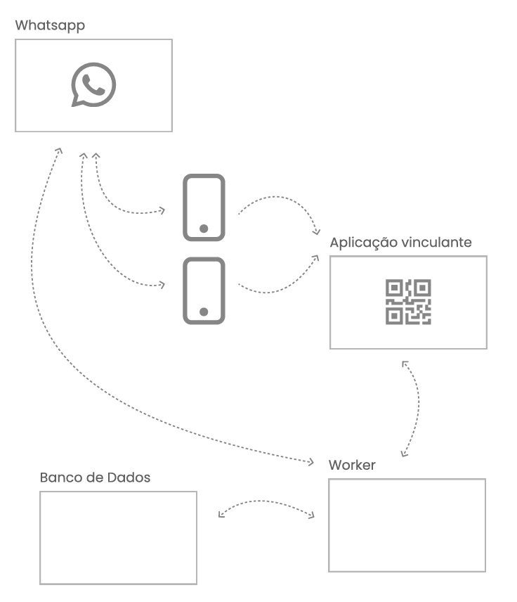

# Modelagem Arquitetural com C4 Model

## Introdução

### Objetivo da Seção

Apresentar os fundamentos da modelagem arquitetural com **C4 Model**, destacando:

* A importância da comunicação visual em software
* Os conceitos iniciais do C4 Model
* Seus níveis de abstração
* Ferramentas e elementos gráficos utilizados

## 1. Apresentação do Curso

Este curso tem como objetivo ensinar, de forma **rápida e prática**, como modelar arquiteturas de software utilizando o
**C4 Model**.

### Abordagem do curso:

* Introdução aos conceitos fundamentais
* Exploração das **4 camadas do C4**
* Aplicação prática com um **projeto real**
* Foco em **clareza e objetividade**

## 2. Canais de Comunicação

* Instagram: [https://www.instagram.com/jorge.sant.ana/](https://www.instagram.com/jorge.sant.ana/)

## 3. Material de Apoio

* Apostila oficial do curso (PDF complementar)

## 4. Por que utilizar uma linguagem de modelagem arquitetural?

### Problema central

Projetos de software frequentemente enfrentam:

* ❌ Ruídos de comunicação
* ❌ Retrabalho
* ❌ Falhas no entendimento de requisitos

Esses problemas impactam diretamente o chamado:

#### 🔺 Triângulo de Ferro

* **Tempo**
* **Custo**
* **Qualidade**

### Conceito-chave

> “Uma imagem vale mais do que mil palavras” — Confúcio

#### Interpretação no contexto de software:

* Ideias complexas são melhor compreendidas visualmente
* Diagramas reduzem ambiguidades
* Facilitam comunicação entre diferentes perfis (devs, negócio, stakeholders)

### Problema dos desenhos informais

* Rabiscos em reuniões ajudam momentaneamente
* Mas se tornam:
    * Difíceis de interpretar depois
    * Inúteis para quem não participou
    * Ambíguos e inconsistentes

### Solução: Linguagens de Modelagem

Exemplos:

* UML
* C4 Model
* 4+1 Model
* MDL

#### Benefícios:

* Comunicação **padronizada**
* Documentação reutilizável
* Clareza para diferentes públicos
* Redução de erros e retrabalho

## 5. Introdução ao C4 Model

### Criador

* **Simon Brown** (Arquiteto de Software)

### Objetivo

Fornecer uma forma **simples e estruturada** de visualizar arquitetura de software.

### Conceito central

O C4 Model organiza a arquitetura em **4 níveis de abstração**, como um **zoom progressivo**:

* Do mais geral → ao mais detalhado

### Analogia: Google Maps

1. Continente
2. País
3. Cidade
4. Rua

➡️ Cada nível revela mais detalhes

### Os 4 níveis do C4 Model

#### 1. Contexto (Context)

* Visão mais ampla
* Mostra:

    * Usuários (atores)
    * Sistemas externos
    * Relacionamentos

👉 Responde: *Como o sistema se encaixa no mundo?*

#### 2. Containers

* Mostra os **grandes blocos do sistema**
* Exemplos:
    * API
    * Banco de dados
    * Frontend
    * Aplicação mobile

👉 Responde: *Quais são as partes principais do sistema?*

#### 3. Componentes

* Detalha o interior de um container
* Mostra:
    * Serviços
    * Módulos
    * Classes principais

👉 Responde: *Como o sistema funciona internamente?*

#### 4. Código (Code)

* Nível mais detalhado
* Diagramas UML (classe, ER)

⚠️ **Observação importante:**

* Não é recomendado manter manualmente
* Alto custo de manutenção
* Código muda constantemente

### Insight importante

> O foco do C4 Model NÃO é a aparência dos diagramas, mas sim os **níveis de abstração**.

## 6. Ferramentas de Modelagem

### Princípio fundamental

> A ferramenta NÃO é o mais importante.
> O mais importante são os **níveis de abstração**.

### Exemplos de ferramentas

#### Ferramentas gerais

* draw.io (diagrams.net)
* Lucidchart
* Miro
* Figma

#### Baseadas em código

* Structurizr
* PlantUML
* Mermaid

#### Corporativas

* Microsoft Visio
* Sparx Enterprise Architect

### Comparação de abordagens

| Tipo              | Vantagem      | Desvantagem          |
|-------------------|---------------|----------------------|
| Visual (draw.io)  | Fácil uso     | Menos automatização  |
| Código (PlantUML) | Automatizável | Curva de aprendizado |
| Enterprise        | Completo      | Complexo             |

### Recomendação prática

* Use **draw.io** para produtividade e simplicidade
* Foque em comunicar, não em dominar ferramentas

## 7. Elementos Gráficos do C4 Model

### Componentes principais

#### Pessoa (Person)

Representa usuários ou atores

#### Sistema de Software

Representa o sistema principal ou externo

#### Container

Representa aplicações ou tecnologias

Exemplos:

* API
* Banco de dados
* App mobile
* Web app

### Relacionamentos

* Representados por **setas**
* Indicam:
    * Direção da comunicação
    * Interação entre elementos

### Legenda

* Uso de cores para:
    * Diferenciar tipos
    * Melhorar leitura

### Conceito-chave

Toda arquitetura é composta por:

* **Componentes**
* **Responsabilidades**
* **Relacionamentos**

## 8. Projeto Prático do Curso

### Objetivo do sistema

Monitorar e auditar conversas de múltiplos números de WhatsApp de uma empresa.

### Componentes principais

* WhatsApp (fonte das mensagens)
* Aplicação Web (gera QR Code)
* Worker (processa mensagens)
* Banco de Dados (armazenamento)

### Visão inicial do sistema

- 

### Funcionamento básico

1. Usuário escaneia QR Code (web)
2. Sistema conecta ao WhatsApp
3. Workers capturam mensagens
4. Dados são persistidos no banco

### Importância deste exemplo

* Demonstra um caso real
* Permite aplicar o C4 Model na prática
* Evolui de **rabisco → arquitetura estruturada**

## Conclusão da Seção

Nesta seção aprendemos sobre:

* A importância da **comunicação visual**
* O impacto dos **ruídos de comunicação**
* O conceito de **modelagem arquitetural**
* Os fundamentos do **C4 Model**
* Seus **4 níveis de abstração**
* Ferramentas e elementos básicos

