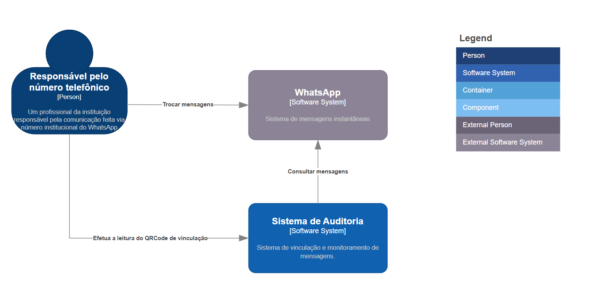

# Abstração de Nível de Contexto (Context)

## Objetivo da Seção

Nesta seção você aprenderá a:

* Compreender o **nível de contexto** do C4 Model
* Identificar **atores, sistemas externos e responsabilidades**
* Construir um **diagrama de contexto claro e acessível**
* Extrair **insights arquiteturais ainda na fase de design**

## 1. O que é o Nível de Contexto?

O **nível de contexto** é a camada mais **abstrata e inicial** do C4 Model.

### Finalidade

Apresentar:

* O sistema principal
* Quem interage com ele
* Quais sistemas externos existem
* Como essas interações acontecem

### Público-alvo

Este nível é direcionado para:

* Stakeholders técnicos (devs, arquitetos)
* Stakeholders não técnicos (negócio, gestores)
* Pessoas externas ao time

👉 Por isso:

* Use linguagem **simples**
* Evite termos técnicos desnecessários
* Foque na **clareza**

### Pergunta que esse nível responde:

> “Como o sistema se encaixa no mundo ao seu redor?”

## 2. Elementos do Diagrama de Contexto

### Principais elementos

* **Person (Pessoa)** → Usuários ou atores
* **Software System** → Sistema principal ou externo
* **Relationship** → Interações entre elementos

### Boas práticas

* Nome claro e objetivo
* Descrição em linguagem acessível
* Relacionamentos com verbos (ex: “consultar”, “enviar”, “gerenciar”)

## 3. Construindo o Diagrama de Contexto

### Sistema analisado

Sistema de Auditoria de mensagens do WhatsApp.

### Passo 1: Identificar o ator principal

#### Responsável pelo número telefônico

* **Descrição:**
  Profissional da instituição responsável pela comunicação via WhatsApp

### Passo 2: Identificar sistema externo

#### WhatsApp

* **Tipo:** Sistema externo
* **Descrição:** Sistema de mensagens instantâneas

### Passo 3: Identificar o sistema principal

#### Sistema de Auditoria

* **Descrição:**
  Sistema de vinculação e monitoramento de mensagens

### Passo 4: Definir relacionamentos

| Origem  | Destino  | Descrição           |
|---------|----------|---------------------|
| Usuário | WhatsApp | Trocar mensagens    |
| Usuário | Sistema  | Ler QR Code         |
| Sistema | WhatsApp | Consultar mensagens |

### Visualização do contexto inicial

### Interpretação

Esse primeiro desenho já permite:

* Entender o **papel do sistema**
* Identificar **fluxos principais**
* Visualizar dependências externas

## 4. Extraindo Insights do Diagrama

### Problema identificado

Pergunta crítica:

> O que impede qualquer pessoa de vincular um número ao sistema?

### Risco

* Qualquer usuário poderia:
    * Vincular números indevidos
    * Comprometer segurança
    * Violar LGPD

### Insight importante

> O diagrama revelou um problema **antes da implementação**

**✔️ Benefício direto:**

* Evita retrabalho
* Reduz impacto em custo e prazo

## 5. Evolução do Diagrama de Contexto

### Nova necessidade

Controle de acesso e gestão de números

### Novo ator

#### Administrador

* **Descrição:**
  Responsável pela gestão dos números monitorados

### Novo relacionamento

| Origem        | Destino | Descrição         |
|---------------|---------|-------------------|
| Administrador | Sistema | Gerenciar números |

### Nova dependência externa

#### Sistema de Login (SSO)

Exemplo:

* Keycloak

### Relacionamento adicional

| Origem  | Destino | Descrição                  |
|---------|---------|----------------------------|
| Sistema | SSO     | Autenticação / Autorização |

### Diagrama de contexto evoluído

