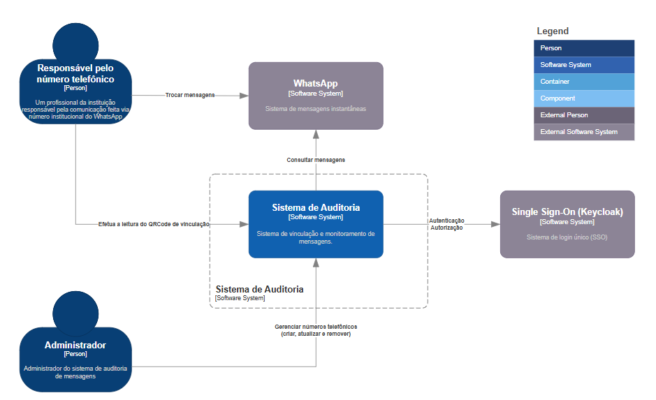
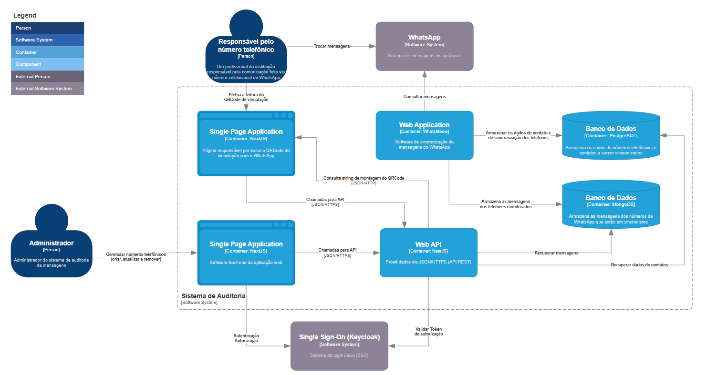

# Architectural Modeling - C4 Model

1. [Introdução](architectural-modeling-c4-model/01-Introduction.md)
2. [Nível 1 - Context](architectural-modeling-c4-model/02-context.md)
3. [Nível 2 - Container](architectural-modeling-c4-model/03-container.md)
4. [Nível 3 - Component](architectural-modeling-c4-model/04-component.md)
5. [Nível 4 - Code](architectural-modeling-c4-model/05-code.md)

## Nível 1 - Context

## Nível 2 - Container

## Nível 3 - Component

## Nível 4 - Code

## Referência

- [Documentação Oficial do C4 Model](https://c4model.com/)

