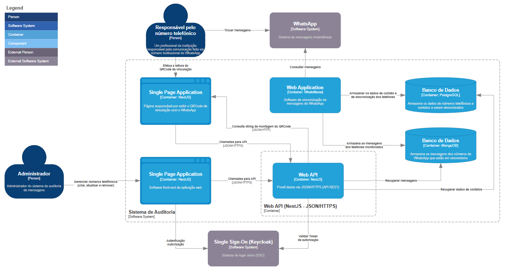
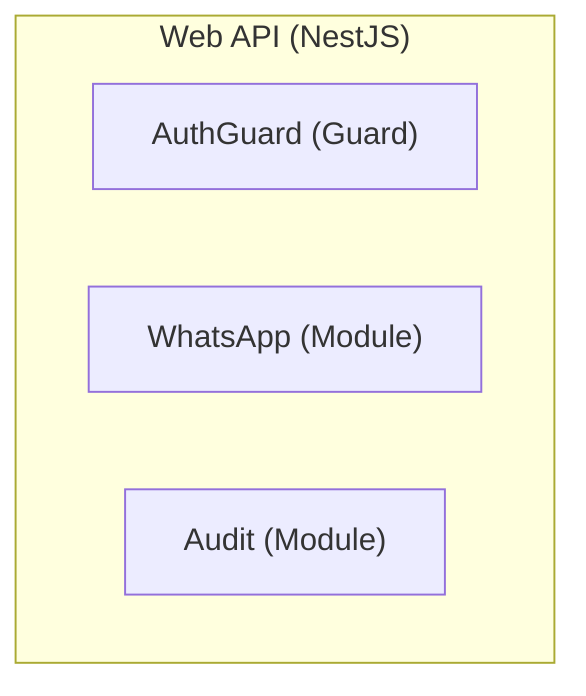
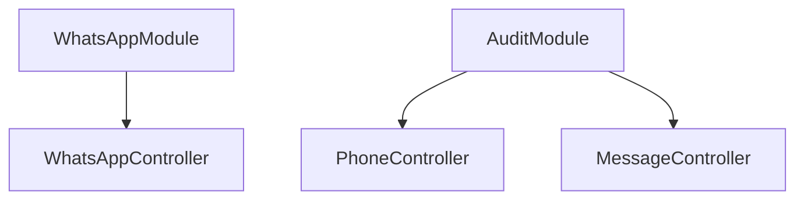
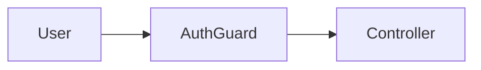
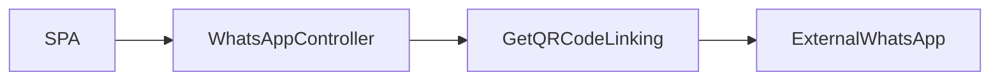
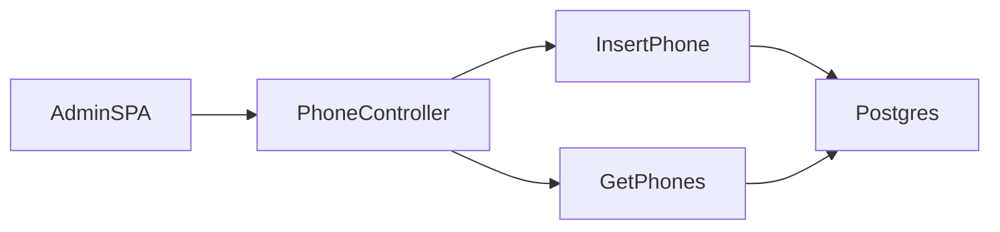
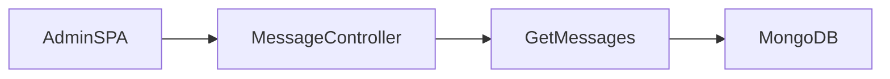
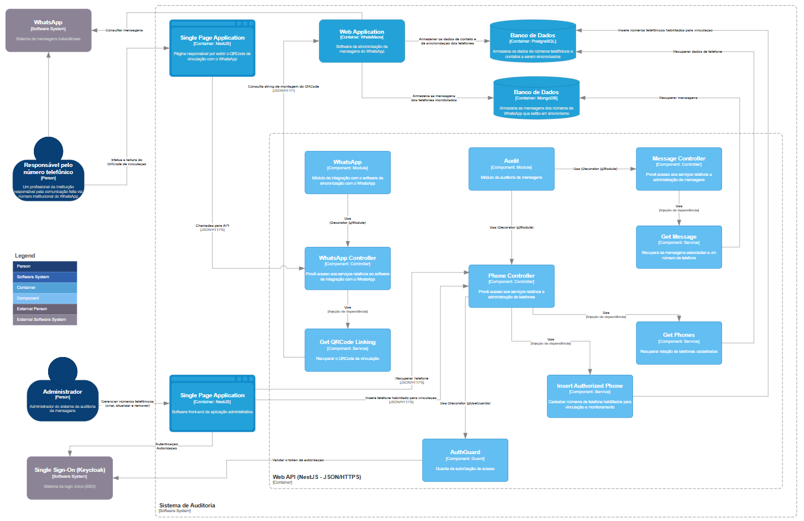

# Nível 3 - Componente (Component)

## 1. Introdução à Camada de Componentes

A camada de **Componentes (Component)** é o terceiro nível do **C4 Model**. Ela representa um **zoom interno de um
container**, detalhando sua estrutura interna.

### Objetivo principal

* Explicar **como um container funciona internamente**
* Identificar:
    * Componentes
    * Responsabilidades
    * Relacionamentos internos e externos

### Características

* Foco em **arquitetos** e **desenvolvedores**
* Alto nível de detalhamento
* Forte ligação com o **negócio** e **requisitos**

## 2. Quando Utilizar a Camada de Componentes

Apesar de útil, **não é recomendada por padrão**.

### Use quando:

* O container é **complexo**
* Há necessidade de **reduzir riscos antes da implementação**
* O time possui **baixa maturidade técnica**
* É necessário **melhorar comunicação técnica**

### Evite quando:

* O sistema é simples
* O detalhamento não agrega valor
* O custo de manutenção da documentação é alto

## 3. Natureza da Abstração

Diferente das camadas anteriores, aqui a modelagem:

* Não é totalmente determinística
* Depende de:
* Requisitos funcionais e não funcionais
* Tecnologia utilizada
* Experiência do arquiteto

### Importante

Não existe um único desenho correto.  
O objetivo é:

> **Reduzir complexidade e minimizar riscos**

## 4. Visão Conceitual da Camada

A camada de componentes funciona como uma **ponte entre arquitetura e código**:

| Nível     | Característica      |
|-----------|---------------------|
| Container | Infraestrutura      |
| Component | Organização interna |
| Código    | Implementação       |

## 5. Escopo de Container

Antes de modelar componentes, definimos o **escopo do container**.

### Exemplo

* Container: **Web API (NestJS - JSON/HTTP)**

## 6. Estrutura Base do Container (NestJS)

A arquitetura segue um padrão em camadas:

* **Modules**
* **Controllers**
* **Services**

### Responsabilidades

| Camada     | Responsabilidade              |
|------------|-------------------------------|
| Module     | Agrupar componentes           |
| Controller | Receber requisições HTTP      |
| Service    | Implementar regras de negócio |

## 7. Primeiros Componentes

### Componentes iniciais

| Nome      | Tipo   | Responsabilidade        |
|-----------|--------|-------------------------|
| AuthGuard | Guard  | Validar autorização     |
| WhatsApp  | Module | Integração com WhatsApp |
| Audit     | Module | Auditoria de mensagens  |

## 8. Representação com Mermaid

## 9. Controllers

Controllers recebem requisições externas.

### Componentes

| Controller          | Responsabilidade    |
|---------------------|---------------------|
| WhatsApp Controller | Integração WhatsApp |
| Phone Controller    | Gerenciar telefones |
| Message Controller  | Gerenciar mensagens |

## 10. Guard de Autorização

O **AuthGuard** protege endpoints privados.

### Fluxo

1. Requisição chega
2. Token é validado
3. Acesso permitido ou negado

## 11. Services — Lógica de Negócio

Services executam a lógica e acessam recursos externos.

### Exemplo: WhatsApp

| Service          | Função        |
|------------------|---------------|
| GetQRCodeLinking | Obter QR Code |

## 12. Services do Phone Controller

| Service                 | Responsabilidade |
|-------------------------|------------------|
| Insert Authorized Phone | Inserir telefone |
| Get Phones              | Listar telefones |

## 13. Services do Message Controller

| Service      | Responsabilidade    |
|--------------|---------------------|
| Get Messages | Recuperar mensagens |

## 14. Relacionamentos Importantes

### Tipos principais

| Relação                | Significado            |
|------------------------|------------------------|
| Usa                    | Dependência            |
| HTTP/JSON              | Comunicação externa    |
| Injeção de dependência | Controllers → Services |
| Decorator              | Modules → Controllers  |

## 15. Integrações Externas

A Web API interage com:

* Single Page Application (SPA)
* Sistema de autenticação (SSO)
* Banco de dados:
    * PostgreSQL (telefones)
    * MongoDB (mensagens)
* Serviço externo do WhatsApp

## 16. Boas Práticas

* Modelar **apenas o necessário**
* Evitar excesso de detalhamento
* Atualizar continuamente durante desenvolvimento
* Focar em:
    * Clareza
    * Comunicação
    * Redução de risco

## 17. Considerações Finais

A camada de componentes:

* É a mais **complexa do C4 Model**
* Possui caráter **criativo**
* Não deve ser usada indiscriminadamente

### Regra principal

> **Só avance para esse nível se houver ganho real de entendimento ou redução de risco**

## 18. Próximo Passo

Após definir componentes:

* Avançar para o **nível de código**
* Detalhar implementação dos componentes críticos

## 19. Diagrama Completo de Componentes

Após a modelagem de todos os componentes — incluindo **guards**, **modules**, **controllers**, **services** e *
*integrações externas** — temos a visão consolidada do container.

Este diagrama representa:

* Estrutura interna completa do **Web API**
* Fluxo de requisições
* Proteção por autenticação
* Integrações com bancos e sistemas externos

## Resumo da Seção

* Componentes detalham o interior de um container
* Representam responsabilidades e interações
* São úteis em cenários complexos
* Devem ser usados com critério

