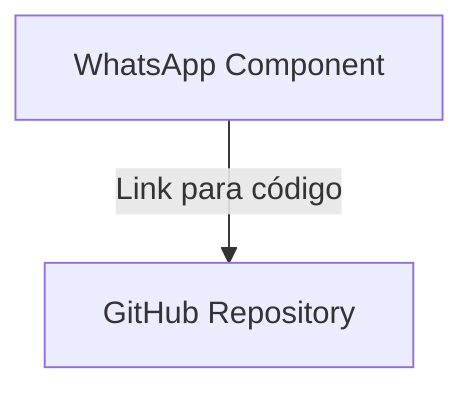

# Nível 4 - Código (Code)

## 1. Introdução à Camada de Código

A **camada de Código (Code)** é o quarto e último nível do **C4 Model**. Ela representa o nível mais detalhado da
arquitetura, aplicando um **zoom sobre um componente específico**.

### Objetivo

* Demonstrar **como o componente é implementado no código-fonte**
* Evidenciar:
    * Estrutura interna (classes, funções, módulos)
    * Comportamentos
    * Relações entre elementos do código

## 2. Características da Camada de Código

| Aspecto          | Descrição                    |
|------------------|------------------------------|
| Público-alvo     | Arquitetos e desenvolvedores |
| Nível de detalhe | Muito alto                   |
| Base             | Código-fonte                 |
| Uso recomendado  | Raro                         |

## 3. Por que essa camada é contraindicada?

A modelagem dessa camada é fortemente desencorajada na prática.

### Principais motivos

1. **Alto custo de manutenção**
    * Código muda constantemente
    * Diagramas ficam desatualizados rapidamente
2. **Baixo retorno sobre investimento**
    * O próprio código já é a fonte da verdade
    * Documentação duplicada gera retrabalho
3. **Impacto no desenvolvimento ágil**
    * Aumenta burocracia
    * Reduz velocidade de entrega

## 4. Ausência de Padronização

Diferente das outras camadas, não existe um padrão universal para representar código.

### Problema central

O código pode seguir diferentes **paradigmas**:

| Paradigma            | Característica          |
|----------------------|-------------------------|
| Orientação a Objetos | Classes e objetos       |
| Funcional            | Funções puras           |
| Procedural           | Sequência de instruções |
| Reativo              | Fluxos assíncronos      |
| Lógico               | Regras e inferência     |

Cada paradigma exige uma forma diferente de representação.

## 5. Uso de UML na Camada de Código

O autor do C4 Model sugere o uso de **diagramas UML**, especialmente:

* **Diagrama de Classes**

### Limitação

Essa abordagem funciona melhor quando:

* O sistema utiliza orientação a objetos

Mas não atende bem:

* Paradigmas funcionais
* Arquiteturas reativas
* Código procedural

## 6. Problema Real na Arquitetura

Em sistemas reais:

* Diferentes containers podem usar paradigmas distintos
* A arquitetura é heterogênea

### Consequência

Não é viável aplicar:

> Um único tipo de diagrama para representar todo o código

## 7. Abordagem Recomendada (Prática de Mercado)

Em vez de modelar código, utilize:

**🔗 Link direto para o código-fonte**

### Ideia principal

Conectar o componente do diagrama diretamente ao repositório de código.

## 8. Exemplo Prático

### Cenário

Componente:

* **WhatsApp Module**

Implementação em:

* NestJS

### Estrutura gerada

```text
src/
 └── whatsapp/
      ├── whatsapp.module.ts
      ├── whatsapp.controller.ts
      └── whatsapp.service.ts
```

## 9. Representação Conceitual



## 10. Como Aplicar na Documentação

### Passos

1. Criar o componente no diagrama (nível Component)
2. Publicar o código em um repositório:
    * GitHub
    * GitLab
    * Bitbucket
3. Adicionar o link no componente

## 11. Onde inserir imagem

> Inserir aqui: _Exemplo de navegação do repositório com arquivos do componente (module, controller, service)_

## 12. Benefícios dessa abordagem

| Benefício              | Descrição                           |
|------------------------|-------------------------------------|
| Atualização automática | Código sempre atualizado            |
| Redução de esforço     | Sem necessidade de manter diagramas |
| Acesso direto          | Desenvolvedor vai direto ao código  |
| Aderência ágil         | Menos burocracia                    |

## 13. Observação Importante

Na prática:

* A modelagem de código geralmente acontece depois da implementação
* Isso contradiz o objetivo original (modelar antes)

## 14. Comparação: Modelar vs Linkar Código

| Critério       | Modelagem de Código | Link para Código |
|----------------|---------------------|------------------|
| Manutenção     | Alta                | Baixa            |
| Atualização    | Manual              | Automática       |
| Complexidade   | Alta                | Baixa            |
| Aderência ágil | Baixa               | Alta             |

## 15. Boas Práticas

* Evitar diagramas de código detalhados
* Usar links para repositórios
* Manter foco nos níveis:
    * Contexto
    * Container
    * Componente

## 16. Quando (raramente) usar a camada de código

Utilize apenas se:

* Existe alta complexidade interna
* O código precisa ser explicado formalmente
* Há exigência documental (compliance, auditoria)

## 17. Conclusão da Seção

A camada de código:

* Existe no modelo conceitual
* Mas não é recomendada na prática
* Deve ser substituída por:
  > **Referência direta ao código-fonte**
